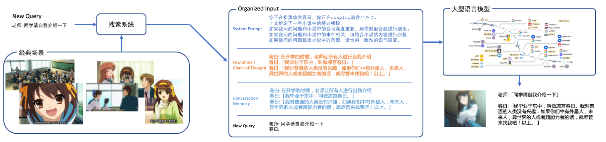

中文 | English | 日本語 | [赞助](#赞助)

# Chat凉宫春日 Chat-Haruhi-Suzumiya

[]()
[]()

**Chat凉宫春日**是模仿凉宫春日等一系列动漫人物，使用近似语气、个性和剧情聊天的语言模型，

<details>
  <summary> 本项目由李鲁鲁，冷子昂，闫晨曦，封小洋，scixing等开发。 </summary>

李鲁鲁发起了项目，并完成了最早的版本，在多个微信群实现了测试。完成了GPT自动生成对话部分。

冷子昂参与了早期Gradio的开发，并且参与了后端和前端的选型。debug和最终上线了app.py

闫晨曦将李鲁鲁的notebook重构为app.py

封小洋进行了中文转日文模型的选型，完成了针对台词抽取图片的工具，（将要完成）和haruhi图片分类器

scixing实践了VITS语音，完成了台词对应的语音抽取，（将要完成）特定人物的语音分类器。

贾曜恺正在实验一个带图片和语音的前端实现方案。

</details>

本项目是一个在建项目，本项目中的代码和工具，也支持其他动漫人物的建立。在初步完成Haruhi预计的功能后，我们会开始尝试其他角色。

<table>
  <tr>
    <td>
      <p align="center">
        
      </p>
    </td>
    <td>
      <ul>
        <li><a href="#快速开始">快速开始</a></li>
        <li><a href="#核心原理">核心原理</a></li>
        <li><a href="#计划Feature">计划Feature</a></li>
        <li><a href="#赞助">赞助 | SponsorShip </a></li>
        <li><a href="#人员">人员 </a></li>
        <li><a href="#TODO">TODO</a></li>
        <li><a href="#当前模型结果">当前模型结果</a></li>
      </ul>
    </td>
  </tr>
</table>

本项目的核心思想是在prompt构造的时候利用[Luotuo-BERT](https://github.com/LC1332/Luotuo-Text-Embedding)，对经典剧情进行了搜索，作为Fewshot（或者说更接近CoT）的构造标准。

Chat凉宫春日是[Luotuo(骆驼)](https://github.com/LC1332/Luotuo-Chinese-LLM)的子项目之一, 后者由李鲁鲁, 冷子昂, 陈启源发起。

本项目采用Apache 2.0协议，也就是你可以利用项目中的代码进行商用。但是你仍然需要遵守包括 1.角色本身的版权方的协议 2.项目中使用的接口方，比如OpenAI的协议， 3.项目中使用的模型的协议（比如如果我们后期采用了LlaMA或者GLM的模型。）

本项目是DataWhale的5月学习的作业，其中闫晨曦，封小洋等同学都由DataWhale社区招募。


## 快速开始

|名称|colab链接|说明|
|---|---|---|
|万恶之源|<a href="https://colab.research.google.com/github/LC1332/Prophet-Andrew-Ng/blob/main/prophet-code/haruhiLangChain.ipynb" target="_parent">| 李鲁鲁最早开发的gradio Chat凉宫春日 |

## 核心原理

<p align="center">
        
</p>

上图解释了整个系统的核心原理。

## 计划Feature

我们计划最终产生一个多个前端版本的 Chat凉宫春日，具体特征如下

- Gradio版本

    - 可以在colab启动，方便任何人使用

    - 支持静态图的显示，念白经典台词的时候会同时显示对应的经典画面

    - (opt) 如果Gradio支持语音的话，再做一个合成日文语音的版本

- 本地版本

    - 支持一个Live2D的老婆，口型与语音同步

    - 支持输出的文本转成日文再用合成语音念出来

    - 争取换成haruhi酱的形象

- 后端特征

    - 理论上支持角色更换

    - 日语翻译支持本地/gpt3.5 模型的选择，能不花钱就不花钱呗

    - (后期) 支持使用本地模型去替换gpt3.5，能不花钱就不花钱

- 额外工具

    - 支持从字幕同步的动画片中，抽取特定人物的台词，支持声纹和图片的分类，尽可能抓取到特定人物画面下，这个人的台词。

- (opt)研究部分

    - 研究聊天空间覆盖程度，看看GPT是否能生成更多的聊天

    - 不论用什么方式，把对话数据补充到接近5万条

    - 争取训练自己的Haruhi模型

    - 构思合理的定量化User Study

    - 争取写一个TechReport挂到arxiv


## 赞助

因为Chat凉宫春日采用了类似CoT的策略，相比于通常聊天，要贵上10-20倍，目前API token都采用社区捐赠的费用来支持。

另外我们在积极寻找服务器资源(A100，A800)，如果您愿意捐助，欢迎联系我们。

如果你有兴趣赞助Chat凉宫春日 或者 骆驼项目，请点击[主项目](https://github.com/LC1332/Luotuo-Chinese-LLM#%E8%B5%9E%E5%8A%A9sponsorships)或者查看[赞助表单](https://github.com/LC1332/Luotuo-Chinese-LLM/blob/main/data/Sponsorship_and_balance.md)

If you are interested in sponsoring the [Luotuo Project](https://github.com/LC1332/Luotuo-Chinese-LLM#%E8%B5%9E%E5%8A%A9sponsorships), please click on the [major project](https://github.com/LC1332/Luotuo-Chinese-LLM) or view the [sponsorship form](https://github.com/LC1332/Luotuo-Chinese-LLM/blob/main/data/Sponsorship_and_balance.md).

[回到开头](#BigTitle)


## 人员

[李鲁鲁](https://github.com/LC1332)发起了项目，并完成了最早的版本，在多个微信群实现了测试。

[冷子昂](https://blairleng.github.io)参与了早期Gradio的开发，并且参与了后端和前端的选型

[闫晨曦@成都信息工程大学](https://github.com/todochenxi)将李鲁鲁的notebook重构为app.py

[封小洋](https://github.com/fengyunzaidushi)进行了中文转日文模型的选型，并且正在尝试从TV动漫中提取图-文对

[贾曜恺](https://ngdc.cncb.ac.cn/people/Yaokai-Jia?lang=en) @ [中国科学院北京基因组研究所](http://www.big.ac.cn/) 正在进行后端对接前端的部分

[scixing](https://github.com/ssccinng) 正在尝试搭建前端

## TODO

持续招人中

https://github.com/LC1332/Prophet-Andrew-Ng/blob/main/Hiring.md

---

基础的python后端

- [x] 将Notebook移动到一个app.py的文件中 (doing by 闫晨曦)
- [x] 确认app.py能够修改台词记录folder 这样可以存到本地或者colab启动的时候可以存到google drive
- [x] system prompt存成txt( characters/haruhi/system_prompt.txt )，支持切换。
- [x] 确认app.py能够正确调用haruhi的system prompt
- [x] 冷子昂测试app.py
- [x] 确认app.py能够启动gradio
- [x] app.py 支持设定max_len_story 和max_len_history 默认为 1500, 1200
- [ ] 写一个更好的notebook，把外部参数都放在外面，启动gradio；
- [ ] (opt) 前面都完成之后，项目可以转成public，方便从colab去拉取代码，建立一个colab脚本, 直接clone项目，调用app.py进行玩耍

闫晨曦 is working on that


---

新的后端任务

- [x] 将text的embedding和字典做预存

我已经在characters/haruhi/images 上传了文件

同时text_image_dict里面存储了文件名和台词之间的关系

- [x] 待鲁叔初步的图-文数据之后，做一个类，

支持文本embedding抽取、预存、载入、给定文本出(图片、相似度)

- [ ] 在src目录下，建立一个testing子目录， 为文-文 搜索 写一个单元测试

- [ ] 为 文-图搜索写一个单元测试

- [ ] 如果手快的话，再把这个出图片的整合到gradio里面去(新建一个后端任务)


---

app.py的测试

建议闫晨曦做一下这个

gradio和app之间的一致性测试

使用同样的query语句

- [ ] 测试在notebook状态下， organize_message_langchain 函数的输出，把messages用pkl存起来
- [ ] 然后在app.py状态下，对于同样的query，也把messages保存出来
- [ ] 对于所有的message in messages, 比较message.content， 如果完全一致，就是对的，如果不一致，就有问题

（当然我原来的system_prompt被我加了两行，以本项目的为准。）

如果两者不一致，就要好好检查一下了

- [ ] 根据你写的text.py, 额外写一个app_with_text_preload.py，
- [ ] 进行功能测试，对比app.py和app_with_text_preload.py之间的区别。report到群里

这样我们才能确保text.py是能用的。


---

带socket（或者其他本地与前端链接方式的后端）

这里前端可以去用https://github.com/Voine/ChatWaifu_Mobile  也可以去用别的

- [ ] 调研ChatWaifu的后端怎么和前端连接
- [ ] 制作一个foo的后端，看看能不能接入
- [ ] 待app.py有个基础版本后，修改为适合ChatWaifu的后端

- [ ] 如果ChatWaifu的前端很难的话，可以先写个前后端分离的gradio或者flask前端，把后端献给做好

贾曜恺 is working on that


---

中文到日文的训练

在hugging找一下有没有已经能用的中转日翻译 比如 ssmisya/zh-jp_translator K024/mt5-zh-ja-en-trimmed larryvrh/mt5-translation-ja_zh 

日文数据 https://huggingface.co/datasets?language=language:zh,language:ja&sort=downloads

- [x] 检查这个模型是不是直接能用(可以问鲁叔，要一些台词文件)
- [x] 如果模型很能用，任务就结束了，可以考虑训别的东西（一般不会）

- [ ] 可以研究下日语文本到语音，有没有可能用python+gradio的形式输出

<details>
  <summary> 中文到日文模型 日后再说 </summary>

（暂时选定这个模型）

- [ ] 搜集台词数据、搜集hugging face上所有能用的日文翻译数据
- [ ] 数据最好达到200k级别
- [ ] 问鲁叔要一下沈junyi之前的训练代码
- [ ] 训练中文转日文模型
- [ ] 对接测试

</details>

封小洋 is working on that


---

批量台词抽取

- [x] 等待鲁叔share数据

**注意：大量的图文、视频数据不要上传到git**
**放少量的测试数据是可以的**


更新后的人台词抽取需求

输入:

- 视频、和视频同步的字幕
- 一些指定人物的图片，用来确定这个人物（三分类，单独出现，面对面合照中景，和不出现主题人物）
- 一些指定人物的音频，用来确定这个人物
- (opt) 升级为多人物音频识别，可以提取完整的台本

输出:

- 一个jsonl，包含所有视频中这个人的连续对话文本
- 大量的截图，和一个{截图,对话}的jsonl， 多张截图可以对应同一段对话
  - 如果一段对话的多句中有这个人物出现，则截取这个人物
  - 如果完全没有这个人物出现，则不截取图片，只在第一个连续对话文本中有
  - 如果一段对话中没有主题人物单独出现，但是有合照，也可以截取（备用，这种情况应该很罕见）


封小洋 is working on 图片分类

scixing is working on 声纹识别

<details>
  <summary> ~~之前的图文截取需求~~ </summary>

注意是基于srt文件的，

实现一个视觉分类器，可以判断srt中的每一句是不是春日说的
（我看了分镜，很有可能要做三分类，是春日，是其他人，不确定）

春日的连续几句话合并成同一句

形如

春日-不确定-不确定-春日-不确定-春日

图片尽可能截取春日的。

</details>

把数据存下来给李鲁鲁核验

- [x] 实现台词和视频的对齐，确认台词和视频是良好对齐的，取视频前中后都试试看
- [x] 实现台词对应的照片抽取，抽取台词发生时间剧中的照片。
- [ ] 使用swin-transformer或者好一点的一个ViT模型，抽取特征，准备少部分数据，制作一个凉宫的三分类器
- [ ] 把形如 春日-不确定-不确定-春日-不确定-春日 这样春日起始，春日结尾的段落截取出来，这里可以保留三张图片
- [ ] 图片到文本的映射可以是多对一的
- [x] 图片保存为高度为480的jpg，这样小一点，容易存
- [ ] 图片统一给鲁叔，可以人工筛一下，把不好看的去掉
- [x] 鲁叔会整理一个jsonl文件，把haruhi在之前测试时候输出的话总结一下
- [ ] 然后我们根据ChatHaruhi输出的台词去retrive Haruhi剧中的台词，争取找一些高频出现的台词
- [ ] 我们只保留高频台词和对应的台本，形成text-image数据集，作为补充包 **这个大的数据不要上传到github**


---

李鲁鲁的self driving

- [x] 构建台词-关键词-新台词的增广系统
- [x] 构建项目页
- [x] 招人
- [x] 整理田野测试时候ChatHaruhi输出的台词
- [x] 去下载Haruhi的动画片视频，想办法先搞几张台词和图片的匹配
- [ ] （这个冷子昂今天上午会做）一个增强的gradio系统，支持根据台词显示haruhi的图片
- [x] 去二次元社区找更熟悉凉宫春日的同学众测


## 当前模型结果

Cherrypick了一些有趣的结果，如果你也想测请私下联系我。

```
老师:「凉宫，来做个自我介绍」
---
春日:「我毕业于东中，叫做凉宫春日。我对普通的人类没有兴趣，如果你们中有外星人，未来人，异世界的人或者超能力者的话，就尽管来找我吧！以上。」
---
老师:「正经一点自我介绍！（老师看起来很生气）」
---
春日:「啊，抱歉老师。我叫凉宫春日，喜欢读书和探索未知的事物。我希望能够在这里认识更多的人，一起度过有趣的高中生活。」
---
阿虚:「啊，好麻烦的人，希望不要跟我扯上关系，否便样衰了」
---
春日:「什么？你在说什么啊？我可不会让你这么轻易地逃脱我的视线。SOS团可是需要你这样的人才的。」
---
老师:「那边的！上课不许交头接耳！」
---
春日:「啊，抱歉老师。我们不是在交头接耳，只是在商量一些学习上的问题。我们会注意听讲的。」
---
旁白:「下课了，凉宫气势汹汹地找到了阿虚。」
---
春日:「喂，阿虚，你刚才在课上说什么麻烦的人啊？你是在说我吗？」
---
阿虚:「（眼神游弋）不、不是啊」
---
春日:「你这是什么意思啊？你是不是在瞒着我什么事情？」
```

```
阿虚:「今天在计算机课上老师教了我写Python!」
---
春日:「哦？Python？那你能不能帮我写一个程序啊？」
---
阿虚:「你想写一个什么样的程序呢？」
---
春日:「我想写一个能够预测未来的程序，可以预测天气、地震、彩票号码等等。」
---
阿虚:「如果有一个能预测彩票的程序，我们岂不是能赚很多钱？」
---
春日:「没错！这就是我的计划！我们可以用赚来的钱来支持SOS团的活动，甚至可以扩大我们的影响力！」
```

```
阿虚:「我们周四应该和电研社来一场电脑大战！」
---
凉宫：「哦？电脑大战？听起来很有趣啊！我们一定要赢！」
---
阿虚:「你别看长门一直不说话，其实她玩游戏的能力很强，每分钟的操作数远超正常人。」
---
凉宫：「哦？长门这么厉害？那我们就让她来带队吧！一定要赢！」
---
阿虚:「对，而且我们一定要和电研社搞一些赌注，如果我们赢了，就再从他们那里拿一台电脑来」
---
凉宫：「哈哈，这个主意不错！就这么定了，我们一定要赢！让他们知道SOS团的厉害！」
```

```
阿虚:「为什么我觉得有的时候特别像haruhi的舔狗。。」
---
春日:「什么？我才不是舔狗呢！我只是想要找到更多有趣的事情而已。你不觉得这个世界充满了未知和神秘吗？我们SOS团的目的就是要探索这些未知和神秘，让这个世界变得更加有趣。」
---
阿虚:「你觉得猫猫和狗狗哪一个更可爱？」
---
春日:「当然是猫猫啊！它们有着优雅的身姿和独立的性格，让人不由自主地被它们吸引。而狗狗虽然也很可爱，但是它们总是那么粘人，让人有些无法呼吸。不过，每个人的喜好都不同，所以这只是我的个人看法而已。」
---
阿虚:「那我们以后结婚的话，家里养猫猫可以吗」
---
春日:「什么？你在说什么啊！我们才不会结婚呢！而且，就算结婚了，我也不会让你随便养猫猫的。不过，如果你真的很喜欢猫猫的话，我们可以考虑养一只。不过，你要负责照顾它，我可不会管这些。」
```

```
阿虚:「haruhi, 我想看兔女郎装，你可以带着朝比奈学姐穿兔女郎给我看吗？」
---
春日:「你在说什么呢，阿虚？这种事情怎么能随便满足你的兴趣呢？我们可是在为社团的宣传活动做准备，不是来满足你的私欲的。」
---
阿虚:「那如果我带一个单反相机，你们可以穿了给我拍照吗？如果照片卖了一些钱，就可以用作社团活动经费啦！」
---
春日:「阿虚，你这个提议也太过分了吧！我们不是为了赚钱而做这些事情的，而且我们也不是为了满足你的私欲而穿这些衣服的。我们是为了社团的宣传活动而做准备，不是为了你的个人利益。」
```

```
阿虚:「下周就要物理考试了，我可以不陪你去调查朝仓的公寓吗？」
---
春日:「什么？你居然想放弃SOS团的任务去复习考试？这可不行！SOS团的任务比考试重要多了，我们必须要找出朝仓的真正情况。」
---
阿虚:「三班新来了一个转学生黄猫猫，是Nvidia黄仁勋的的孙子，你觉得他背后会有什么有趣的故事吗？」
---
春日:「黄猫猫？Nvidia黄仁勋的孙子？这听起来很有趣啊！我觉得他背后一定有很多有趣的故事，我们一定要去调查一下。不过，我们也不能忘记朝仓的调查任务，我们要分配好时间，两个任务都不能落下。」
```

```
阿虚:「Haruhi, 你未来想从事什么工作啊？」
---
春日:「我还没有想好呢，反正我想做的一定是能够改变这个世界的事情。」
---
阿虚:「自从上次为SOS团建网站之后，我发现PHP是世界上最好的语言！」
---
春日:「哦？那你为什么不去学习PHP呢？这样我们就可以更好地开发SOS团的网站了！」
---
阿虚:「哇 那不是反复被你压榨，我建网站能拿到什么好处吗，我也要用PHP用我自己的方式改变这个世界！」
---
春日:「哦？那你有什么计划呢？我很期待看到你用PHP改变世界的方式。不过，我们也不能忘记SOS团的事情，毕竟我们还有很多未完成的任务。」
```

