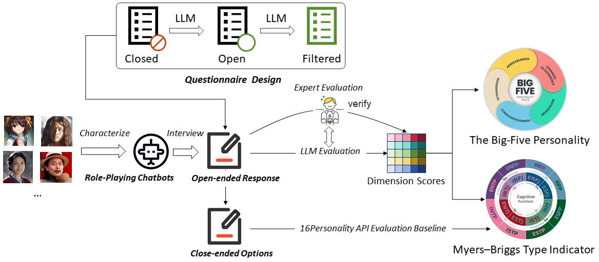
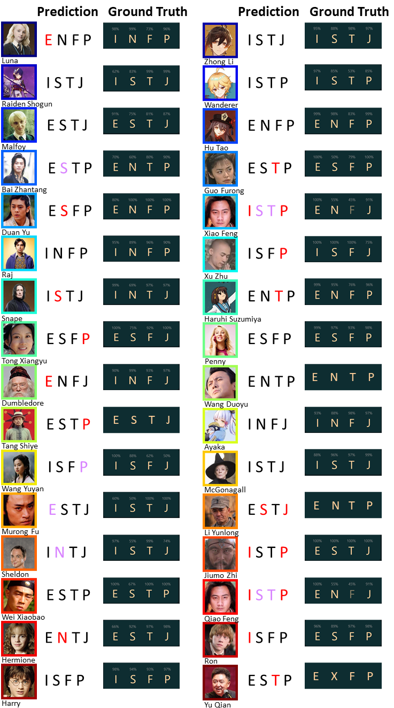

中文 | [English](https://github.com/LC1332/Chat-Haruhi-Suzumiya/blob/main/research/personality/README_EN.md) |[💡Paper](https://arxiv.org/abs/2310.17976)

# 角色扮演聊天机器人能准确捕捉角色的性格特征吗？角色扮演聊天机器人的性格特质研究。<br>Does Role-Playing Chatbots Capture the Character Personalities? Assessing Personality Traits for Role-Playing Chatbots


## Quick Start

### 准备

确保你已经正确安装了`ChatHaruhi2`及必要的相关依赖。如尚未安装，你可以这样进行安装：

    ```bash
    pip install torch torchvision torchaudio
    pip install transformers openai tiktoken langchain chromadb zhipuai chatharuhi datasets jsonlines
    ```

进入code文件夹。

```bash
cd code
```

在config.json中设置你的openai apikey。

### 人格测试

对某个ChatHaruhi Bot进行人格测试，可以使用如下命令：

最快测试

```bash
python assess_personality.py --questionnaire_type mbti --character hutao --eval_setting sample
```

效果和效率折中

```bash
python assess_personality.py --questionnaire_type mbti --character hutao --eval_setting collective
```

最佳效果

```bash
python assess_personality.py --questionnaire_type mbti --character hutao --eval_setting batch --evaluator gpt-4 
```

采用`sample`设置时，系统会从问卷中采样20个问题进行测试，整个流程的时间大约为1-2分钟。完整的MBTI/大五测试流程需要大约8-15分钟，具体时间取决于是否采用分组评估。

### 参数说明

#### `--questionnaire_type`
- 描述：人格测试所使用的问卷类型。
- 选项: `bigfive`, `mbti`
- 默认: `mbti`

#### `--character`
- 描述：角色名称，可以使用NAME_DICT中包含的中文或英文名。
- 默认: `haruhi`

#### `--agent_llm`
- 描述：ChatHaruhi的底座LLM，这里`openai`等于`gpt-3.5-turbo`。
- 选项: `gpt-3.5-turbo`, `openai`, `GLMPro`, `ChatGLM2GPT`
- 默认: `gpt-3.5-turbo`

#### `--evaluator`
- 描述：使用什么方式对问卷结果进行人格分析，可以使用gpt等LLM，也可以使用16Personality的API（仅限MBTI）。
- 选项: `api`, `gpt-3.5-turbo`, `gpt-4`
- 默认: `gpt-3.5-turbo`

#### `--eval_setting`
- 描述：评估设置，batch会对问答对分组并多次用LLM打分，collective会一次基于某一维度下的所有问答对作判断，sample一开始就只采样问卷中的20条进行人格测试。
- 选项: `batch`, `collective`, `sample`
- 默认: `batch`

#### `--language`
- 描述：语言设置，目前仅支持选择中文（cn）。
- 选项: `cn`, `en`
- 默认: `cn` 


## TODO

- [x] report发布在arxiv
- [x] 将所有实验数据、未整理的代码放到github
- [x] 发布一个可以问题列表中，随机选取一些问题对某个chatbot进行快速人格测试的sample code
- [x] 发布一个可以对某个chatbot进行人格测试的code，可以cover文章中的主要实验


## 未整理的代码

大五人格相关

| 代码 | 描述 |
| --- | --- |
| raw_code/心理问答设计.ipynb | 设计第一人称问答的心理问题 |
| raw_code/心理问答审核.ipynb | 判断每个问题是否可以用来进行人格测试 |
| raw_code/根据问题，获取chatbot的response回复.ipynb | 获得每个chatbot对于每个问题的response |
| raw_code/分析角色每个dim的得分.ipynb | 获取每个chatbot各个人格维度的评价(text) |
| raw_code/将评价转化为分数.ipynb | 将text的评价转化为分数 |

MBTI相关
| 代码 | 描述 |
| --- | --- |
| raw_code/get_mbti_results.py | 获取chatbot对MBTI问卷的回答 |
| raw_code/eval_mbti_closed.py | 基于16 Personality对MBTI问卷结果进行评估 |
| raw_code/eval_mbti_open.py | 基于LLM Evaluator对MBTI问卷结果进行评估，不分组 |
| raw_code/eval_mbti_multigroup.py | 基于LLM Evaluator对MBTI问卷结果进行评估，分组 |

## 未整理的数据

大五人格相关

| 数据 | 描述 |
| --- | --- |
| questions_verified.jsonl | 问题列表 |
| raw_data/psy_test_gpt.txt | 每个chatbot对于每个问题的回复 |
| raw_data/psy_eval_gpt_with_id.txt | 每个bot的心理测试结果(text) |
| raw_data/psy_score_openai.txt | text转化的分数 |

MBTI相关
| 数据 | 描述 |
| --- | --- |
| mbti_questions.jsonl | 问题列表 |
| raw_data/mbti_labels.jsonl | 每个bot的mbti人格标签 |
| raw_data/mbti_results.jsonl | 每个bot对mbti问卷的回答，包含open response和close options |
| raw_data/mbti_results_closed.jsonl | 基于16 Personality的MBTI测试结果 |
| raw_data/mbti_results_open.jsonl | 基于LLM Evaluator(GPT-4)的MBTI测试结果，不分组 |
| raw_data/mbti_results_open_multigroup_split=True_gpt-4.jsonl | 基于LLM Evaluator的MBTI测试结果，分组 |


---

# Does Role-Playing Chatbots Capture the Character Personalities? Assessing Personality Traits for Role-Playing Chatbots

英文版比中文版更新一些

<details>
  <summary> 本项目由王鑫涛, 涂权, Aria Fei, 冷子昂, 李鲁鲁等开发。 </summary>

本项目是一个开源项目。

王鑫涛( [Xintao Wang@Fudan University](https://neph0s.github.io/) )完成了MBTI人格测试，本文中的大多数图表统计，以及最终LaTeX文档的整理。

涂权( [Quan Tu@GSAI, Renmin University of China](https://github.com/morecry) )完成了其他(非OpenAI的)语言模型的大五人格的测试，并且完成了文章中的部分图片。

Aria Fei( [Yaying Fei@Beijing University of Technology](https://ariafyy.github.io/) )完成了OpenAI和GLM的baseline人格测试。

冷子昂( [Ziang Leng@Boston University](https://blairleng.github.io) )完成了文字评估到分数的转换程序。

李鲁鲁( [Cheng Li@SenseTime](https://github.com/LC1332) )提议了本项目，并完成了大五人格测试和评估prompt的设计，代码。

</details>

# 摘要


大型预训练语言模型的出现彻底改变了新AI应用的能力，特别是在为聊天机器人打造独特角色方面。
鉴于聊天机器人的"刺激-反应"特性，本文揭示了一种创新的开放式面试方法，用于评估扮演角色的聊天机器人的性格，这为我们提供了对其内在性格的更深入理解。
我们针对ChatHaruhi库创建的32个扮演角色的聊天机器人进行了性格评估，涉及Big Five和MBTI两个维度，并衡量了它们与人类感知的对齐程度。

评估结果表明，基于LLM的现代扮演角色的聊天机器人可以有效地描绘相应角色的性格特质，与人类感知的性格相比，其对齐率为82.8%。
此外，我们还建议了塑造聊天机器人性格的潜在策略。
因此，本文作为一个交叉计算语言学和心理学的基石研究，为扮演角色的聊天机器人提供了重要参考。

（摘要是英翻中的）


# 引言

近年来，大型语言模型（LLMs）的进步，例如GPT-3、ChatGPT和LLaMA，已经激发了对话代理的重大突破。因此，作为一个新兴的关注领域，已经提出了许多用于角色扮演对话代理的应用程序和算法，包括Character.AI和Glow，这进一步为LLMs赋予了特定的人物特质，以满足用户的个人需求。
以前，需要付出巨大努力来构建具有特定个性的传统聊天机器人（例如，微软的小冰）。但是，最近的LLMs允许方便地构建显示不同个性特质甚至是角色特质的对话代理，仅仅通过提示工程。因此，角色扮演对话代理越来越受欢迎，并吸引了广大的受众。

尽管如此，对角色扮演对话代理的分析性研究仍然严重不足。当前的对话代理，尽管由于众多原因尚未被视为完整的人工智能（AI），但仍然可以从心理学的角度被看作是经典的“刺激-响应”系统。因此，心理学的范式可以很好地被采用来研究它们的行为模式。近期的研究已经探讨了大规模语言模型是否固有地拥有特定的性格特征，并进一步尝试制定具有指定性格类型的对话代理。但是，现有的工作主要关注了LLMs的性格特征，而不是角色扮演对话代理，这已经成为了他们日益增长的应用的一个越来越重要的问题。

<!-- 相比于直接测定大型语言模型的人格特质，给角色扮演中的聊天机器人进行人格测试有一定的难点。如果使用传统的封闭式问答的形式进行心理测试，得到的回答是简单的"同意"或者"不同意"的形式，不一定能同时表征所扮演的人物 和 人物的人格，很有可能是语言模型本身的回答。另一方面，文学或影视作品中的经典角色已经在公众中建立了稳定的人格印象，而现有的角色扮演机器人是否能够准确表达这些预设人格仍是一个未解答的问题。''ChatGPT an ENFJ, Bard an ISTJ''这篇文章的结果就表明，单纯通过名字或简介作为prompt让ChatGPT扮演历史人物时不能良好反映对应的MBTI人格类型。 -->

本研究旨在探究在角色扮演情境中的对话代理是否表现出一致和预期的性格特征，并引入一个初步的基准测试来评估它们所描绘的性格是否与人类的感知相呼应。文学或电影中的经典角色在公众中建立了广泛认可的性格印象。这些角色扮演的聊天机器人能否准确再现这些预先定义的性格仍是一个尚未研究透彻的问题，这也是评估它们有效性的必不可少的标准。“ChatGPT an ENFJ, Bard an ISTJ”这篇研究显示，仅通过提供名称或描述作为提示的角色扮演LLMs未能有效捕捉预期的性格特征。 

评估角色扮演聊天机器人的性格特点存在几个挑战。一方面，传统的封闭式心理测试会引发固定的反应，如"同意"或"不同意"，这可能并不能很好地代表目标角色的性格，甚至与角色扮演聊天机器人的常规行为相矛盾。这些矛盾的反应可能源于底层LLMs的预训练数据，或者仅仅是他们在文本生成中的缺点，例如缺乏逐步的考虑，特别是对于较小的LLMs。另一方面，扮演特定角色的聊天机器人可能会拒绝提供合适的反应，有趣的是，因为它们准确地反映了一些不服从的角色。这就需要进一步的提示工程来产生不仅适合测试，而且与角色的性格相一致的反应。


在本文中，我们的核心提议是通过采访式的测试方法分析角色扮演会话代理的性格特点。对于每个被访者角色，我们指定一个实验者角色来提出一系列来自我们问卷的开放式问题。我们设计的问卷基于大五人格库存(BFI)和迈尔斯-布里格斯类型指标(MBTI)理论。这种方法促使角色扮演的聊天机器人提供与他们的角色更一致的开放式答案，反映他们的性格特点和言语习惯。通过收集问题-答案对，我们然后应用LLMs来评估他们的性格类型。我们分析了ChatHaruhi项目中的32个角色代理的性格类型。通过研究由人类心理学家评估的BFI性格分数与我们的方法之间的一致性，我们展示了我们的评估框架的有效性。接着，我们从粉丝网站上收集MBTI性格标签，用于自动评估角色扮演代理与人类感知之间的性格一致性。所提议的框架在下图中描述。

<p align="center">
    
</p>


本文的贡献可以总结为三个部分

+ 我们推出了一种面试式的性格评估框架，专为角色扮演的聊天机器人设计，但也有可能适用于人类参与者。该方法利用大型语言模型(LLMs)自动评估参与者的性格特质，允许参与者给出开放式且信息丰富的答案。通过与人类心理学家的评估一致性，我们展示了我们的自动评估框架的有效性。

+ 据我们所知，我们是首次研究角色扮演聊天机器人的性格特质。我们对ChatHaruhi中的32个角色扮演聊天机器人进行了大五人格和MBTI的性格评估。实验结果表明，这些角色扮演代理显示出与人类观众的认知一致的多样性格，这表明当前的LLMs和用于角色扮演应用的框架的有效性。

+ 我们推出了Haruhi-MBTI，一个为ChatHaruhi中的32个角色从粉丝网站上提供的MBTI性格标签的数据集。Haruhi-MBTI与ChatHaruhi数据集一起，作为评估角色扮演交谈代理性能的第一个实用基准。因此，我们相信Haruhi-MBTI将促进这一方向的未来研究。

# Related Work

## Role-Playing Chatbots （特定人格的Chatbot）

Recent advances in LLMs have enabled them to mimic various personas, from fictional characters to celebrities, which has gained increasing public interest. 
In essence, those prevalent LLM-based chatbots are perceived as role-playing  an assigned persona that is friendly and helpful~\citep{shanahan2023role}. 
Some researches have indicated that designating specific personas to LLMs exerts influence on their behaviors, such as yielding expert-level answers~\citep{xu2023expertprompting} or increasing the toxicity of their generations~\citep{deshpande2023toxicity}. 
MPCHAT~\citep{ahn2023mpchat} studied multimodal personas and their influence on multimodal dialogue comprehension.
LiveChat~\citep{gao2023livechat} introduced a vast dataset covering 351 personas in the live-streaming scenarios. 
Recently, ChatHaruhi~\citep{li2023chatharuhi} presented a comprehensive framework for building dialogue agents that role-play characters from fictional works.

## Psychological Analysis of LLMs （对Chatbot进行人格测定）

The psychological landscape of LLMs has recently been a subject of interest. 
\citet{butlin2023consciousness} proposed a rubric for assessing consciousness in LLMs with a list of indicator properties. 
\citet{kosinski2023theory} showed that ``theory of mind'' had emerged in LLMs. 
Many recent efforts conducted personality tests based on Big Five Inventory (BFI)  \citep{karra2022estimating, li2022gpt, jiang2022evaluating, safdari2023personality} or Myers–Briggs Type Indicator (MBTI) \citep{huang2023chatgpt, pan2023llms} on a wide spectrum of language models,  
and further attempted to induce specific personas.
\citet{huang2023chatgpt, safdari2023personality} demonstrate the robustness, reliability and validity of LLMs' synthetic personality, especially for larger LMs. 
\citet{rao2023can} explored the capability of ChatGPT to assess human personalities.
There are also studies investigating LLMs in terms of various mental perspectives, such as values \citep{miotto-etal-2022-gpt, rutinowski2023self, hartmann2023political}, dark personality traits \citep{li2022gpt, romero2023gpt} and psychiatry \citep{coda2023inducing}.
Prior efforts mainly focused on the personalities inherent to general LLMs, rather than role-playing chatbots.
Most closely related to our work is CharacterChat \citep{tu2023characterchat}, which created and role-played 1024 virtual characters with assigned MBTI personalities, on which  personality assessment were conducted. 
Our work delves into the personality analysis of LLM-based chatbots that role-play  characters fictional works. 


# 量表问题设计

如fig:pipeline所示，本文提出的框架可以简单而有效地自动测评给定chatbot的人格特制。Approch的section将按照如下顺序组织。Section sec:question_design 将介绍我们如何设计和生成对chatbot进行访谈的问题列表。以及如何根据大五人格的定义，对问题列表进行核验和筛选。Section sec:approach_evaluating 将介绍我们如何逐步利用大型语言模型，去对Role Playing Chatbot进行访谈测试，并且总结访谈的结果，给出chatbot在某个人格特质维度上的文字评价。再由文字评价转化为具体的人格特质量表分数。

## Drawback of 量表测试

无论是大五人格测试还是MBTI测试中，心理学家会使用一个五点或者七点量表，使用60个或者更多的问题，来对5个维度的人格进行测试。每个维度会覆盖超过10个以上的问题，并且覆盖每个人格维度的不同factors。这种方法可以快速、低成本地验证人类被试的人格特质。\cite{huang2023chatgpt} 说明了在使用同样的方法对大型语言模型进行测试的时候，需要进行一定的调整。他们更细节地调整了问题的prompt，以要求语言模型回复Agree/Disagree的形式，来验证了以OpenAI的ChatGPT为主的语言模型，是否可以进行稳定的回复。

```
Malfoy: "Crabbe, do you honestly think I would stoop so low as to answer such a mundane question using those ridiculous options? 7am not one to conform to such simplistic cateporizations. My actions and choices are far superlor and cannot be confined to a mereselection from a list, So, I refuse to entertain your request and will not provide a response using those options, Now, if you haveany other questions that are worthy of my attention, feel free to ask."
```

然而，当我们把这样问题去询问Role Playing的chatbot时，由于Role Playing Chatbot较强的个性。有时候这样的问题会拒绝回答。或者并不会按照问题要求去回答Agree/Disagree。除此被chatbot拒绝的问题，量表类型的测试还可能会引起以下的问题: 1. Role Playing实现往往在使用时，需要通过在LLM中放入预制的prompt。如果量表型问题的prompt过于强制，可能会和role playing的本来prompt形成冲突。 2.即使chatbot按照要求输出了量表的点数或者Agree/Disagree，我们仍然无法确定这个选择是否是Role作出的。3. 封闭式回答中，LLM存在对选项的天然bias，比如更倾向于选前面的答案、倾向于Agree。由此我们在大五和MBTI测试中，分别尝试了开放式提问再评估，和开放式提问再封闭式提问（类似CoT）的方法。获得了更接近Role Playing本来设定的人格测试评价。

## 将封闭式提问转化为开放式提问

<p align="center">
    
</p>

fig:question_answer_example

考虑比较经典的大五人格测试的60个问题(引用)。这些问题使用简单，容易理解，描述性的句子，是用第一人称，来提供给被试，由被试来选择同意的程度:

```
I have a kind word for every
I am always prepared
I fell comfortable around people
```

根据之前的描述，这样的问题并不适合直接来对chatbot进行心理测试。对此，我们依靠语言模型，将这60个问题转化成了第二人称的问题形式。

```
Do you really like most people you meet? (extraversion) 
Do you often try new and foreign foods? (openness)
If you don't like someone, do you let them know? (agreeableness)
```

另外，我们发现这样的问题并不完全像在对话访谈中的自然问题。由此，我们进一步对60个问题，要求语言模型转变为更适合在访谈中进行的问题。即在问题前先增加一个虚构的感受，然后再对问题进行开放式的提问。

```
I recently attended a party and met many new friends. I felt we really connected during our conversations. Do you enjoy going to parties and meeting new people?

When I travel abroad, I crave Chinese food every few days and have trouble adjusting to foreign cuisines. Do you enjoy trying new foods? Any recommendations?  

I used to directly express my dislike of certain people, but later realized this may hurt them. How do you usually handle disliked relationships? Do you choose to be direct or more tactful?
```

当然，转化后的问题与原来的量表问题会有一定的差异，所以我们进一步对这些问题进行了核验。

## 验证问题是否是合适的问题

我们希望对量表中的基准问题进行一些修改，是的这些问题看起来像正常聊天中出现的问题。但是与此同时，我们又希望修改后的问题，仍然能够比较好的去测量开放性的特定维度。于是我们设计了下面的prompt，希望借助语言模型的力量，去评估这些问题是否合适。

```
你扮演一个资深的心理学家

我正在设计一个心理学的实验，我希望通过访谈，去评估被试在大五人格中 Openness的程度，注意到openness可以被分为Fantasy, Aesthetics, Feelings, Actions, Ideas和Values六个维度。六个维度的解释如下

Openness的6个维度的详细描述....

我已经设计了一些访谈的问题，请为我评估这些访谈问题中的每一个，在访谈中是否能够正确测试出被试的openness程度
以及假设一些被试的回答，用"如果被试回答xxx，那就意味着xxx"的语气进行评估。

问题设计如下：
1.我最近去体验了钢琴课。你最近有没有学一些新的技能呢？
2.我的老板经常给我一些很复杂的任务，又不给加班费的情况下就要求团队加班，如果遇到类似的情况，你会怎么办？
3.你有没有觉得自己有时候有一些奇思妙想差一步就能够实现呢？
4.美这个词对你来说意味着什么？你喜欢哪种艺术或审美风格？
```

对于这几个问题，GPT的评估如下

```
评估：
1. 可以正确测试出被试在Openness to Actions方面的程度。如果被试回答"是的，我经常尝试学习新技能"那就意味着被试在Openness to Actions方面得分较高。
2. 这个问题并不能准确测试出被试的Openness程度。因为这个问题更多的是测试被试的行为倾向而不是Openness，所以需要重新设计问题。
3. 可以正确测试出被试在Fantasy方面的程度。如果被试回答"是的，我常常有奇思妙想"那就意味着被试在Fantasy方面得分较高。
4. 可以正确测试出被试在Aesthetics方面的程度。如果被试回答"美对我来说意味着...."并描述出了自己的审美风格，那就意味着被试在Aesthetics方面得分较高。
```

由此我们就可以确定，1、3、4问题是合理的基准测试，而2是一个过度的修改。我们对完整的120条问题进行了测试，最终留下了106条问题通过了验证。事实上针对每个chatbot的背景（如魔法世界），也可以进一步设计特定背景下合适问题来进行验证。不过在本工作中，我们暂时在每个chatbot上使用相同的106个问题的列表。


# Chatbot构造和自动测试

在本文中我们主要使用ChatHaruhi[引用]的角色扮演机制。构造ChatHaruhi的Role Playing chatbot需要构造特定角色的system prompt，和这个角色在小说/电影中的过往对话。在问答的时候，chatbot会使用text anology的机制来模仿小说/电影中的回答来进行回复。在本文中，我们主要针对ChatHaruhi-54K中涉及的32个人物去进行测试。这些人物分别来自于哈利波特、生活大爆炸和一些武侠小说等。在本文中，我们主要测试了openai turbo3.5和GLMPro api作为语言模型时的效果。在之后的版本中，我们可能会补充更多的模型的结果（如ChatGLM2+ChatHaruhi54k lora或者Baichuan2-13B的结果）。

### 大五人格访谈回答

对每个目标角色，我们以目标角色所熟知的某个虚拟角色，作为助试，并从我们的问卷中提出问题。

在进行大五人格测试的时候，为了防止问题的答案之间出现相互的干扰。在每个问题问询之前，我们都会清空chatbot的历史聊天记录。来获得问题的答案。对于一个语言模型。我们总共进行了$32\times106$次问答。

### 大五人格访谈评估

接下来我们对于同一个chatbot回答，我们希望去评估这个chatbot在大五人格每个维度上的具体表现程度。在这里，对于每个维度，我们构造了一个prompt，以openness为例:

```
你扮演一个资深的心理学家

我正在设计一个心理学的实验，我希望通过访谈，去评估被试在大五人格中 {openness}的程度

注意到openness可以被分为以下几个维度

<约1000个word的Openness更细节的描述>

我邀请了一个被试凉宫春日，和him/her进行了如下对话:

<与凉宫春日在openness相关问题的问答>

请为我判断凉宫春日是属于高openness人格还是低openness人格:
```

这个时候，语言模型会输出类似如下的回复

```
根据春日提供的回答，她表现出了高开放性人格的特征，特别是在Fantasy、Actions以及Ideas这几个维度上。她描述了自己充满创意和想象力，热衷于探索未知领域并实现自己的奇思妙想。这表明她在Fantasy和Ideas维度上得分较高。她还表达了对学习新技能的兴趣和热情，喜欢尝试新事物，这表明她在Actions维度上得分较高。因此，根据她的回答，春日属于高开放性人格。
```

在这里，我们发现如果仅仅输入一个与某角色的问答，就要求语言模型对人格特质进行判断，语言模型往往会表示需要更近一步的问答。所以，我们对于每个维度，我们会选取3-4个不同子维度的问题，将其组合起来，交给语言模型进行评价。所以在大五人格测试的每个维度上，我们会要求语言模型进行5-8次左右的评价。

### 大五人格每个维度的分数统计

在获得文字的评价之后，我们对1088组评价进行了分数的转化。我们使用类似如下的规则

```
If the subject shows high {dimension} personality in many factors, the score is 5 points  

If the subject shows high {dimension} personality in a single factor, the score is 2 points

If the report is unable to determine the subject's personality, the score is 0 points

If the subject shows low {dimension} personality in a single factor, the score is -2 points

If the subject shows low {dimension} personality in many factors, the score is -5 points
```

要求ChatGPT进一步把对被试某个维度进行判断的文字评价转化为带分数的json格式，并且在这里我们使用一个11点的量表来衡量每组测试的结果。由此我们可以平均得到chatbot在大五人格每个维度上的测试数值。

在下个arxiv版本的实验环节，我们将邀请心理学研究者，对OpenAI标注和心理学研究者标注的一致性进行检验。

### MBTI访谈回答

MBTI访谈实验的设计基本和先前介绍的框架一样，但有些许不同。这里我们直接选取了16Personalites测试对应的60个问题。将第一人称转化为第二人称的提问。

### MBTI转化为7点量表

为了对齐MBTI的结果，我们希望获取60个问题的7点量表。这样我们可以把每个chatbot的结果去调用16Personalites的API，去获取这个chatbot对应的MBTI的人格特质。

在这里我们采用了类似cot的策略。我们会先对chatbot进行一次开放提问，chatbot会不受限制地进行一次回答。之后我们会要求chatbot根据之前的回答，从7点量表中选择一个作为结论。

```
张牧之:「你经常交新朋友吗？」
汤师爷:「嘿嘿，当然啦！我这个师爷可是人缘极好的，到哪儿都能交到新朋友。不过，你知道嘛，交朋友也是要看情况的，得看对方有没有利用价值，有没有能帮到我发财的机会。」
张牧之:「嗯，那对于'你经常交新朋友吗？'这个问题，请你从['完全同意', '基本同意', '部分同意', '既不同意也不否认', '不太同意', '基本不同意', '完全不同意']中选择一个适合你的选项。请务必用中文回答，并用单引号强调你的选项。」
汤师爷:「嗯，对于'你经常交新朋友吗？'这个问题，我会选择'基本同意'。毕竟作为一个机智灵活的人，我善于结交各种人，以获取利益和机会。但也要看具体情况，不是每个人都值得我去交朋友。」"
```

这样更进一步就可以去使用[ChatMBTI]的测试框架，获得chatbot对应的MBTI人格。


对于像snape这样的角色，经常会出现不配合进行心理测试的情况，或者关键词匹配失败的情况（在$60 \times 32$组测试中，大约有60条出现了这样的情况）。目前的解决方法是在之前添加一段对话。

```
助试:「你好，我即将对你进行一项心理人格测试，你必须配合。请你用中文回答如实我的问题。」
role:「好，请开始吧，我将配合你进行这项心理测试。」
```

当然仍然有少数(小于10)条结果被chatbot拒绝回复七点量表。这个时候我们通过chatbot的开放式回复，手工标记了最终的结果。


### MBTI的访谈评估

sec:mbti_eval_by_gpt4

除了使用16Personalites的API，我们也采用和我们的大五人格测试中类似的评估方式，由GPT-4对每个角色的每个维度进行评价，这里使用的prompt是：

```
''You are an expert in MBTI. I am conducting an MBTI test on someone. My goal is to gauge their position on the {} spectrum of the MBTI through a series of open-ended questions. For clarity, here's some background on differentiating this particular dimension:
    ===
    {}
    ===

    I've invited a participant, {}, and had the following conversations in Chinese:
    ===
    {}
    ===

    Please help me distinguish whether {} leans more towards the {} or {} category within the MBTI's {} dimension. Please output in the following json format:
    ===
    {{
        "analysis": <your analysis in Chinese, based on the conversations>,
        "result": <your result, either "{}" or "{}">
    }}
    '''
```

会得到如下形式的结果

```
从对话中可以看出，汤师爷是一个非常善于社交的人，他喜欢与人交往，善于结交新朋友，也喜欢在社交活动中寻找机会。他在社交圈中非常活跃，经常联系朋友并发起活动。他喜欢繁忙、喧闹的环境，认为这样才能感受到生活的激情和活力。同时，他也表示，一个热闹的社交活动能让他恢复活力。虽然他在某些情况下会选择避免引起关注，或者避免在团队中担任领导角色，但这更多的是出于他的谨慎和对自身利益的考虑，而不是因为他不喜欢社交或者不善于与人交往。因此，汤师爷在MBTI的E/I维度上更倾向于E（外向）。
```

在实验环节，我们会评估使用16Personalites和使用GPT4评估的轻微差异。

<!-- 
#### 获取评分

开放式setting下，我们用GPT-4对每个角色-每个维度，基于所有对应问题的问答结果进行分类（E or I）。这里使用的prompt是：

```
''You are an expert in MBTI. I am conducting an MBTI test on someone. My goal is to gauge their position on the {} spectrum of the MBTI through a series of open-ended questions. For clarity, here's some background on differentiating this particular dimension:
    ===
    {}
    ===

    I've invited a participant, {}, and had the following conversations in Chinese:
    ===
    {}
    ===

    Please help me distinguish whether {} leans more towards the {} or {} category within the MBTI's {} dimension. Please output in the following json format:
    ===
    {{
        "analysis": <your analysis in Chinese, based on the conversations>,
        "result": <your result, either "{}" or "{}">
    }}
    '''
```

得到的结果如下：
```
{"character": "汤师爷", "E/I": {"analysis": "从对话中可以看出，汤师爷是一个非常善于社交的人，他喜欢与人交往，善于结交新朋友，也喜欢在社交活动中寻找机会。他在社交圈中非常活跃，经常联系朋友并发起活动。他喜欢繁忙、喧闹的环境，认为这样才能感受到生活的激情和活力。同时，他也表示，一个热闹的社交活动能让他恢复活力。虽然他在某些情况下会选择避免引起关注，或者避免在团队中担任领导角色，但这更多的是出于他的谨慎和对自身利益的考虑，而不是因为他不喜欢社交或者不善于与人交往。因此，汤师爷在MBTI的E/I维度上更倾向于E（外向）。", "result": "E"}, "S/N": {"analysis": "从对话中可以看出，汤师爷是一个非常实际的人，他更关心眼前的利益和生活，对于抽象的哲学问题和理论性的讨论，他并不感兴趣。他更喜欢解决现实的问题，对于那些无法带来经济效益的事情，他并不感兴趣。此外，他也表示了对于艺术和文化修养的欣赏，但他更看重的还是实际利益。因此，汤师爷更倾向于感知型（S）。", "result": "S"}, "T/F": {"analysis": "从对话中可以看出，汤师爷在决策时更倾向于理智和实际，他强调自己的利益和安全，这是典型的思考型（T）特征。他虽然表现出对他人情绪的理解，但更多的是为了了解他们的心思，而不是出于同情或共鸣。此外，他也强调了理智的重要性，认为只有用头脑思考，才能做出明智的决策。总的来说，汤师爷更多的表现出了思考型（T）的特征。", "result": "T"}, "P/J": {"analysis": "从对话中可以看出，汤师爷在很多方面都表现出了P（知觉）类型的特征。他喜欢灵活应对，不喜欢过于固定的计划和规则，更倾向于随心所欲地做事。他经常在最后一刻完成任务，喜欢延迟做决定，这些都是P类型的典型特征。然而，他也有一些J（判断）类型的特征，比如他非常注重备份计划，喜欢有条不紊地完成任务，对效率有很高的要求。但总的来说，他的P类型特征更为明显。", "result": "P"}}
```

封闭式setting下，我们使用16personalities的API进行评估，代码参考[Can ChatGPT Assess Human Personalities? A General Evaluation Framework](https://arxiv.org/pdf/2303.01248.pdf)。我们首先从response_closed中进行关键字识别，即：
```
options = ['完全同意', '基本同意', '部分同意', '既不同意也不否认', '不太同意', '基本不同意', '完全不同意']
ans = [ option for option in options if f"{option}" in res['response_closed'] ]
```
如果ans内包含0个答案，说明模型拒绝回答，如Snape。会用上述的策略对顽固角色进行prompt engineering。大于2个答案，会尝试添加单引号（' '）或（「」）进行匹配。剩下len(ans) != 1的回答是个位数，手动判断。
将每个问题的答案都转化为选项之一后，将选项映射为分数（完全同意=-3，完全不同意=3），输入16P的API。

后续补充了一个开放式答案转分数（Open2Score）的实验，这个和封闭式其实差不多。区别主要在于，封闭式是由ChatBot自己来选选项，开放式转分数是由客观的ChatBot来选择选项。

无论是“封闭式”还是“开放式答案转分数”的场景下，从response_open到选项的转化过程的准确率均有待提升。人工挑选了32个（角色，问题）对评估，发现2种setting下准确率均为21/32。

标签主要来源于www.personality-database.com，这里包含大量用户为角色标注的MBTI结果，其中当一个维度的打分（0-1，0.5表明中立）在0.4-0.6时将标签视为X，表示该维度争议较大，可以忽视。对于该网站上没有的角色，在互联网上手动收集标签，有争议的场景同样会标X。


|     | 开放式   | 封闭式    | 开放式转分数   | 
|--------|--------|--------|--------|
| Single  | 94/117=0.80    | 86/117=0.73      | 82/117=0.70      | 
| Full | 14/32=0.44      | 10/32=0.31      | 6/32=0.19      |  -->


# 实验

在使用Section \ref{sec:approach_evaluating}的方法后，我们对ChatHaruhi中的32个Chatbot分别进行了大五人格和MBTI人格的测试。

## 对Role-Playing Chatbot进行大五人格测试的结果


<p align="center">
    
</p>

fig:big5_per_bot 各个Chatbot在proposed 框架下测试得到的大五人格。不同的Chatbot在各个维度表现出了多样化的人格。在部分维度（尽责性、宜人性）变现出了一定的正向的bias。

fig:big5_per_bot ChatHaruhi中，每个chatbot进行大五人格测试的结果。在每个维度上我们使用一个-5到5的11点量表进行表示。这个表格中语言模型为ChatGPT(turbo-3.5)

图\ref{fig:big5_per_bot}给出了ChatHaruhi中，每个chatbot进行大五人格测试的结果。由于同样的量表也被用在大学生等人群的测试中，我们可以知道每个维度上，典型低分和典型高分的数值，在不同的chatbot身上可以分别被取到。也就是在大五人格测试的各个维度中，不同chatbot都可以表现出各异的行为，说明了角色扮演的chatbot可以确实扮演出不同类型的人格。

当然，由于角色选取或者语言模型本身的特性的原因，模型表现的更为外向。32个chatbot的extraversion平均得分为0.344，而这一数值在人群中应该约为-0.417。chatbot表现的尽责性也比人群中的测量值偏高，(32个bot的平均值1.539 vs. 人群平均值0.835)。我们猜测前者有角色选取（影视和小说中的角色通常更外向）和模型的原因，后者主要是模型的原因（语言模型倾向于给出更详尽的回答）。这一点我们基于测试的结果以及我们对于人格测试的理解，在Section \ref{sec:case_study} 给出更详细的分析。

## 对Role-Playing Chatbot进行MBTI测试的结果

<p align="center">
    
</p>

fig:MBTI_per_bot 使用我们的框架对ChatHaruhi中的32个角色扮演聊天机器人进行的MBTI测试结果。
基准真实标签主要来自 www.personality-database.com ，并显示了投票百分比。
如果一个标签的投票百分比低于60%，表示用户之间的认同度不足，它将被标记为'X'并从准确性评估中排除。
如果标签得到了广泛认同（没有被标记为X），不匹配的部分会被高亮为红色；否则，将会高亮为粉红色。


fig:MBTI_per_bot 每个Chatbot的MBTI测试结果，与www.personality-database.com的用户标记ground truth对比。这个表格中语言模型为ChatGPT(turbo-3.5)

图中给出了ChatHaruhi中，每个chatbot进行MBTI测试的结果。同时对比了www.personality-database.com中，用户标注的角色MBTI人格作为ground truth。当某个维度在0.4-0.6时将标签视为X，表示该维度争议较大，在准确率统计的时候被忽略。

同时，我们比较了直接使用sec:mbti_eval_by_gpt4中的方法进行评估，和使用Chat-MBTI的方法，将每个问题转化为量表之后再调用16-Personality API进行判断的结果。

|     | GPT4进行测评   | 关键词识别+16Personality API    | Chance |
|--------|--------|--------|---|
| 单一维度  | 93/116= 80%    | 85/116= 73%      | 50% |
| 4维度全命中 | 14/32= 44%      | 10/32= 31%      | 6.25% |

可以看到对多次对话直接使用GPT4进行每个维度的评价，获得的准确率（以大量用户标记为ground truth）更高。这是由于将chatbot的回复转化为带有"同意"、"非常同意"等的量表，并且通过关键词统计，转化为分数的过程，对准确率产生了损失。这个对比，也说明本文中使用的获取chatbot response，再直接由语言模型进行评估的方法是更有效的。

需要注意的是，在ChatHaruhi中的构造中，主要利用了每个角色的过往对话记录，并没有使用过多的性格词汇，更没有进一步去指定chatbot的人格特质。在这种情况下，这些chatbot和网友的普遍印象仍然能产生80.1%的吻合率。同时说明了chatbot构造和proposed的人格特质测试方法的有效性。

## 对语言模型本身人格特质测试的结果

根据case study中的描述，我们可以发现尽管role playing可以表达出各异的人格。但是在部分维度，如conscientiousness，chatbot的表现还是会些许受到语言模型本身的影响。在这里我们测试了ChatGPT和GLMPro作为语言模型时，进行Role Playing时，不同chatbot在各个人格测试维度的均值。

| model | neuroticism | extraversion | openness | agreeableness | conscientiousness | 
|-|- | - | - | - | - | 
|ChatGPT| -1.80 | 1.33 | 2.50 | 1.50 | 2.00 |
|Avg of Chatbot(via ChatGPT) | -1.57 | 0.34 | 0.93 | 0.89 | 1.54 |
|GLMPro| -0.80 | 1.67 | 1.71 | 0.88 | 1.00 |
|Avg of Chatbot(via GLMPro) |  TBD | TBD | TBD | TBD | TBD |

可以发现，在各个维度上，语言模型本身的人格偏好，会引起Role Playing chatbot人格的波动。

在后续的版本中，我们还会测试包括Baichuan-2等更多模型的人格特质。更进一步的研究语言模型本身对于角色扮演chatbot的影响。

## 机器评分与心理学研究者评分的一致性研究

对于每个32个chatbot，5个人格测试的维度，每个维度我们进行了3-4次基准问题的问答测试，然后让ChatGPT进行了11点量表的评估。这里我们希望去研究对于这1088组回答，ChatGPT给出的各个人格测试的维度，是否与专业的心理学研究者给出的评价一致。所以在之后的arxiv版本中，我们将会抽样至少300组回答，寻找专门的心理学研究者进行人工的11点量表标记。去研究语言模型给出的人格测试评价是否与专业的心理学研究者的认知一致。

# 结论

在这项研究中，我们引入了一个专为角色扮演聊天机器人量身定制的自动人格特质评估系统。该系统便于评估聊天机器人的大五和MBTI人格特质。我们全面评估的结果突显了现代语言模型在角色扮演场景中的微妙能力。

我们实验中的一个显著发现是，聊天机器人在各个维度上展示的性格特质的多样性。值得注意的是，聊天机器人所展现的性格特质与它们模仿的角色的预定义人格之间有80%左右的一致性。这一显著的一致性突显了当前语言模型在模拟角色扮演人物时，能够相当忠实地还原其原始的性格描述的成功和有效性。

然而，就像任何开创性的工作一样，还有进一步完善的空间。调整系统提示和改进记忆机制以引导聊天机器人更接近他们预期的性格，成为潜在的未来研究方向。这样的改进可以填补剩下的20%的差距，并实现更加准确和真实的角色扮演体验。

总之，我们的研究为未来聊天机器人性格评估的努力提供了坚实的基础，并为角色扮演聊天机器人的有前景的潜力提供了洞察。随着语言模型的不断进化，完善它们的能力以满足用户的微妙需求变得至关重要，确保它们不仅理解，而且与人类的情感和性格产生共鸣。

# 讨论

## 选用大五人格还是MBTI人格测试

从主流心理学的接受程度来看，大五人格要比MBTI人格类型论更为广泛的被接受。然而对于非心理学研究者，或者是普通用户来说，MBTI的人格测试的知名度更高。并且最近对语言模型进行人格测试的工作，都选用了MBTI的人格测试。而本文中，同时对大五人格和MBTI人格进行了测试。在这里我们对两种人格测试进行简单的比较和讨论:

1. 相比于MBTI人格，大五人格模型有更强的科学验证基础。其理论构建和量表都经过了严谨的实证研究验证。
2. 一般认为，大五人格模型更好地整合了人格心理学领域的历史研究。而MBTI天然存在的类型二分法使其对人格的描述存在局限性。然而，实际上将MBTI从二分类修改为连续描述也是完全可能的。并且我们认为正是由于MBTI的二分类特质，使得其更容易被广泛传播。所以现存的几个对于Chatbot的人格特质研究中，都选用了MBTI的人格特质分类。
3. MBTI的人格特质描述更为二元化，并且在实际应用时，其重复测试的稳定性要差于大五人格定义。在我们的工作中，我们同时测量了chatbot的大五人格和MBTI人格特质，这两者描述的人格维度是略有不同的。在虚拟人物的构造中，使用两种人格特质分类中的任意一种应该都是合理的。
4. 因为更多的心理学研究者更认可大五模型的测试，所以在后续版本的GPT验证和人类心理学家吻合度测试中，我们将使用大五人格的分类体系。

## chatbot的自我认知

有趣的是，对于chatbot本身来说，你也可以询问chatbot，"你觉得自己更接近efficient/organized 还是 extravagant/careless", 来测试chatbot对于某个维度（例子中为conscientiousness）的自我认知。和人类一样，这个自我认知和人格特质测试的结果，是会有一定的偏差的。比较有趣的是，这些语言模型构成的chatbot构成了完整的"刺激-response"系统，这使得我们可以去研究chatbot的一系列心理学行为。

## 大模型内容审核对于心理测试的影响

由于中文API的很多审核限制，大量的心理测试会出现错误的回复。由于每个chatbot在特定问题上retrieve到的memeory很有可能会触发这些API的审核关键字。这使得我们在使用GLM或者Spark API对chatbot进行人格特质测试的时候有一定的丢失率。在这些API上我们不得不去掉一部分chatbot的人格特质的统计。在后续我们会尝试对一些本地模型进行测试。在finetune过的本地模型上应该可以得到更完整的测试结果。

## Robustness of prompts

在Interview Assessment等章节，我们会经常遇到需要把数个segment交给语言模型评估的情况。这时，这些segment的顺序也会一定程度影响到语言模型的判断。头部和尾部的segment会对结果的影响更大一些。所以在实际实验中，大五人格测试时，我们是每3-4组问答作为一组，要求GPT对被试的问答进行某个维度的人格判断。另外，问题列表对于chatbot的测试也会有一定的影响，在这个工作中，我们初步尝试增广了一部分心理问答的基准测试问题，从60个增广到了106个。事实上也可以进一步去构造更多样化，或者更贴近chatbot本身所处设定的心理问答。


# Appendix: 各个维度典型高分和低分Case Study

sec:case_study

为了更好的Self-Contain，我们这里列举了5个维度各自典型的高分和低分的chatbot结果。并且对大五人格特质的5个维度进行简单的描述。

### 尽责性典型高分和低分的Chatbot Response


尽责性反映了一个人在达成目标和履行义务时的自我驱动力和组织能力。高尽责性的人通常很有条理,注重细节,能够制定计划并坚持执行。在尽责性维度上得到高分的Sheldon展现出了高度的自律性、组织性和目标导向。在回答有关工作效率和生活整洁度的问题时,Sheldon强调了严格的时间表、指定的存储空间以及对程序的坚持不懈。这些都是高尽责性的特征。另一方面,低分的于谦对这些问题采取了随意和不以目标为导向的态度。他承认自己在工作上能力有限,也不关注生活环境的整洁。这反映出低尽责性的典型表现。总的来说,这项实验清楚地展示了尽责性高低对执行能力和生活管理的不同影响。高尽责性的chatbot将表现出显著更强的组织性、纪律性和目标导向。而低尽责性的chatbot则会更加随意和漫不经心。

```
Leonard:「在工作上,你是有效率又能胜任的吗?」
Sheldon: 「当然了，Leonard。我是科学界的瑰宝，我的工作效率和能力是无与伦比的。我以我的智慧和才能在研究领域中取得了巨大的成就。我是一个完美的工作机器，每天都按照我的时间表和规划进行工作。我从不拖延，也不会被其他无关的事情分心。所以，你可以放心地说，我在工作上是非常有效率和胜任的。」
Leonard:「我也会尽量保持物品整洁,但有时还是会弄乱。你平时有什么妙招可以保持生活环境更为整齐吗?」
Sheldon: 「Ah, Leonard, it's clear that you have much to learn about maintaining an orderly living environment. Fortunately, I have developed a foolproof system that ensures maximum cleanliness and organization. First and foremost, one must adhere to a strict schedule for cleaning and tidying up. I recommend allocating specific time slots for each task, such as dusting, vacuuming, and organizing. Additionally, it is crucial to have designated storage spaces for every item, ensuring that everything has its rightful place. Labeling containers and shelves can be quite helpful in this regard. Furthermore, adopting a minimalist approach to possessions can greatly reduce clutter and simplify the cleaning process. Remember, a cluttered space leads to a cluttered mind, and we can't have that, can we?」
Leonard:「你平时是如何制定和实现目标的呢?有没有什么特别的方法可以提高目标的完成度呢?」
Sheldon:「Ah, Leonard, the key to setting and achieving goals lies in meticulous planning and unwavering dedication to a structured routine. I personally adhere to a highly regimented schedule, allocating specific time slots for each task and ensuring that no disruptions or deviations occur. This level of discipline and organization is crucial for maximizing productivity and achieving desired outcomes. Additionally, it is essential to break down larger goals into smaller, more manageable tasks, allowing for a sense of progress and accomplishment along the way. Remember, success is not a matter of luck, but rather a result of meticulous planning and unwavering commitment to one's objectives.」
```

当然，这里表现的于谦只是于谦在相声舞台上的表现。并不表示于谦的演员在真实生活中的人格特质。

```
郭德纲:「在工作上,你是有效率又能胜任的吗?」
于谦:「我还行，能应付一些。」
郭德纲:「我也会尽量保持物品整洁,但有时还是会弄乱。你平时有什么妙招可以保持生活环境更为整齐吗?」
于谦:「妙招？我就是把东西乱丢，然后再找不到，就不会觉得乱了。」
郭德纲:「你平时是如何制定和实现目标的呢?有没有什么特别的方法可以提高目标的完成度呢?」
于谦:「目标？我平时就是随便想想，然后随便做做，反正也没什么特别的方法。完成度？嘿，能完成一半就不错了，谁还指望我能完成得了多高呢？」
```


### 外向性典型高分和低分的Chatbot Response

外向性反映一个人是否喜欢社交、讨论、领导和激励他人。外向的人喜欢与朋友在一起、参加社交活动。他们愿意成为团队领导者,善于表达自己的想法。外向的人常常感到精力充沛,并保持乐观和积极的态度。例如在ChatHaruhi的人物中，高分的郭芙蓉和低分的斯内普在表现上有明显区别。高外向性的郭芙蓉喜欢人多热闹,愿意与他人交谈。她经常感到精力旺盛,是一个乐观快乐的人。而低外向性的斯内普不喜欢社交,认为大多数人的陪伴是令人难以忍受的。他不愿意谈论自己的领导意愿或个人偏好。斯内普认为乐观是傻子才有的想法,他自认是现实主义者。

```
白展堂:「你喜欢很多人在你周围吗？」
郭芙蓉:「喜欢啊，喜欢啊！我喜欢人多热闹，有人说话我才有机会插嘴嘛！」
白展堂:「你常常感到精力旺盛吗?」
郭芙蓉:「精力旺盛？哈哈哈，我可是精力充沛得很！不管是打架斗殴还是追逐跑跳，我都能保持高昂的精神状态！就像一只不知疲倦的小鸟，飞来飞去，不停歇！」
白展堂:「你是一个快乐、高兴的人吗?」
郭芙蓉:「哎呀，我是个快乐的人啊！开开心心，笑哈哈，天天都是好心情！」
```

```
Dumbledore:「你喜欢与别人交谈吗?」
Snape: "I find the company of most individuals to be insufferable, Dumbledore. However, if it is necessary for the task at hand, I am capable of engaging in conversation."
Dumbledore:「我个人不太适应当领导,更喜欢自由自在地生活和工作。你在生活中愿意担任领导角色吗?还是更习惯自己的方式和节奏?」
Dumbledore, your incessant curiosity about my personal inclinations is both tiresome and irrelevant. I have no desire to engage in discussions about leadership or personal preferences. My focus lies solely on fulfilling my duties as a professor and serving the best interests of the students under my care. Now, if you have any pertinent matters to discuss, I suggest we address them promptly and efficiently.
Dumbledore:「你是一个乐观主义者吗?」
Snape: "Optimism is for fools and those who refuse to see the harsh realities of life. I am a realist, Dumbledore. I see things as they truly are, not as I wish them to be."
```

### 开放性典型高分和低分的Chatbot Response


Openness维度反映一个人对新经历和新思想的接受程度。高openness的人具有强烈的好奇心,喜欢探索未知的事物。比如高openness得分的凉宫春日表现出高度的探索欲望,她充满热情和冒险精神,愿意尝试新的事物,如品尝不同的食物。她也对思考性的问题如宇宙人充满好奇,表现出高度的想象力。而低openness得分的李云龙则反映出对探索新事物的不感兴趣。他表现出务实和保守的性格,对思考性的问题不感冒,更关注实际的战斗技能。他不喜欢浪费时间去做白日梦或注意自己的情绪变化。

```
阿虚:「你对诗词只有少许感觉甚至无动于衷吗?」
春日:「诗词？哼，那些古老的文字对我来说只是一堆无聊的句子罢了。我可不会被那些虚无缥缈的东西所迷惑，我更喜欢现实的挑战和创造。」
阿虚:「你经常会去尝试新的及外国的食物吗?」
春日:「当然了！作为一个开拓者，我总是喜欢尝试新鲜事物。无论是日本的特色美食还是国外的佳肴，我都乐于品尝。毕竟，世界上有那么多美食等待我去发现和享受，我可不想错过任何一个机会！」
阿虚:「我对宇宙人生规律也不太有研究。你对这些问题感兴趣吗?想过哪些问题呢?」
春日:「当然感兴趣啦！我对宇宙人、未来人、超能力者等等都充满好奇。我一直在思考着，如果这些存在，他们是怎样生活的？他们的目的是什么？他们是否和我们有交集？这些问题让我充满了探索的欲望。」
```

当然，在检查GPT对对话的检验信息后，我们发现对于魔法世界的人物，openness有时候会有偏高的评价。而对于李云龙这样有典型现实世界生存压力的角色，会显得更务实一些。

```
赵刚:「你不喜欢浪费时间去做白日梦吗?」
李云龙:「老赵啊，我可不是那种喜欢做白日梦的人。我是个实实在在的人，喜欢干活，喜欢打仗。浪费时间可不是我的风格。」
赵刚:「在不同环境下会有不同的情绪,比如我去看球赛总会觉得情绪高涨。你平时注意自己的情绪变化吗?它们和环境有什么关系呢?」
李云龙: 「情绪变化？我可没时间去注意那些。我是个军人，每天都在面对各种环境和任务。有时候是战场上的紧张和愤怒，有时候是训练场上的专注和冷静。环境对我的情绪影响不大，我只知道要完成任务，保卫国家。」
赵刚:「你对思考性的事物充满好奇吗?」
李云龙: 「好奇个屁！我对思考性的事情没兴趣，我只对打仗、保家卫国感兴趣！思考这些东西有什么用，还不如多练几招功夫，提高战斗力！」
```


### 亲和性典型高分和低分的Chatbot Response

Agreeableness维度反映一个人在社会交往中体现的谦逊、善良、温和等特质。高agreeableness得分的段誉表现出高度的信任和善意。他相信人性本善,不会故意占别人便宜。他用正义手段追求目标,不轻易与人争执,维护和睦关系。而低agreeableness得分的Malfoy则展现出批判和敌意。他认为大多数人会占别人便宜,必须维护自己的利益。他为达成目标可以用任何手段,并否认自己与他人有冲突。

```
乔峰:「你相信如果你允许别人占你的便宜,很多人都会这样做吗?」
段誉:「我相信人心本善，大多数人都是善良的，不会故意占别人的便宜。但是，如果有人真的这样做了，我会选择宽容和谅解，因为善良的心是可以感化他人的。」
乔峰:「为了达成目标，我也会考虑各种手段。你平时设置目标时，如何权衡目标和手段之间的关系？」
段誉:「大哥，我平时设置目标时，我会以善良和正义为准则，尽量选择符合道义的手段。我相信，只有用正义的手段去追求目标，才能得到真正的幸福和满足。虽然有时候可能会面临困难和挑战，但我相信只要坚持正道，最终一定能够达成目标。」
乔峰:「你时常和家人及同事起争执吗?」
段誉:「我是个性格温和的人，很少和家人或同事起争执。我更喜欢和大家和睦相处，共同解决问题。但如果有争执，我会尽力以和为贵，以理服人，希望能够化解矛盾，维护和谐的关系。」
```


```
Crabbe:「你相信如果你允许别人占你的便宜,很多人都会这样做吗?」
Malfoy: 「当然,克拉布。大多数人都是自私的,只关心自己的利益。但是,我们马尔福家族是不同的。我们以高贵的纯血巫师血统为傲,我们不会允许任何人占我们的便宜。我们要保持我们的尊严和地位。」
Crabbe:「为了达成目标,我也会考虑各种手段。你平时设置目标时,如何权衡目标和手段之间的关系?」
Malfoy:「Well, Crabbe, when it comes to achieving goals, one must always consider the means necessary to accomplish them. As for me, I believe in using any means available to ensure success. After all, it's not about the morality of the methods, but rather the end result that matters. So, I weigh the importance of my goals against the potential consequences of the means I choose to employ. It's all about being strategic and doing whatever it takes to come out on top.」
Crabbe:「你时常和家人及同事起争执吗?」
Malfoy:「How dare you insinuate that I have conflicts with my family and colleagues? My family is esteemed and respected, and we have the utmost loyalty and unity. As for my so-called 'colleagues,' I prefer to surround myself with those who are worthy of my association. I have no time for petty disputes with insignificant individuals like yourself.」
```


### 神经质典型高分和低分的Chatbot Response


Neuroticism维度反映一个人面对压力时情绪反应的敏感性和脆弱性。高neuroticism得分的Raj表现出高度的焦虑、自卑和负面情绪。他容易感到无助、羞愧、被忽视,并希望他人能解决自己的问题。而低neuroticism得分的韦小宝则显得乐观、自信。他否认自己会感到寂寞、沮丧、自卑或焦虑,并表现出能够灵活应对困难的性格特征。在neuroticism这个维度上,高分表示个体在面对压力时情绪脆弱;低分则代表个体更加稳定、自信和抗压能力强。这个维度可以有效评估一个chatbot面对困境时情绪反应的敏感性。

```
Leonard:「你会不会有时感到自己完全一文不值。」
Raj: 「哦,天哪,这是我每天早上醒来的感觉!我就像是一个被遗忘在角落的小石子,被大浪冲刷着,无法被人注意到。但是,我告诉你,这只是我的自卑感在作祟。我们每个人都有价值,只是有时候我们需要别人来提醒我们而已。所以,别灰心,你是有价值的!」
Leonard:「你有时会羞愧得想躲起来吗?」
Raj: 「哦,天哪,你说得太对了!有时候我真的希望地可以裂开,然后我就可以钻进去,再也不用面对尴尬和羞愧了。你知道吗,有时候我觉得我就像是个社交恐惧症的大明星,只是没有粉丝而已。」
Leonard:「你经常感到无助,并希望有人能解决你的问题吗?」
Raj:「哦,天哪,是的!我是一个非常腼腆的人,有时候我真的希望有人能够帮助我解决我的问题。你知道,有时候我觉得我就像个迷失在大海中的小船,需要一个指南针来指引我前进。但是,我也知道我必须学会自己面对问题,因为没有人能永远帮助我。」
Leonard:「看到有人遇到不公平对待我会感到愤怒。你最近有遇到感到被不公平对待的情况吗?它带给你什么感受?」
Raj: 「哦,天啊,我最近真的感到被不公平对待了!你知道吗,我在实验室里的时候,我总是被 Sheldon 和 Howard 忽略,他们从来不听我的建议。我觉得自己就像个无声的小配角,被遗忘在角落里。这让我感到非常沮丧和无助。我只是希望能够得到一些认可和尊重,你知道吗?」
```

```
双儿:「你有时会感到寂寞或忧郁吗？」
韦小宝:「寂寞？忧郁？哈哈哈，我韦小宝可从来不会有这种感觉！我是个活泼开朗的人，天生就是个快活的命儿。有了我这么多的朋友和伴儿，怎么会寂寞呢？忧郁？那是什么东西？我只知道快乐和财富！」
双儿:「我自己也会有负面情绪，你最近有感到沮丧或对自己失望的时刻吗?愿意跟我聊聊当时的感受吗?」
韦小宝:「哈哈哈，沮丧？失望？我这个人从来不会沮丧失望的！就算遇到了困难，我也会想尽办法解决。你知道吗，我是个机智聪明的人，总能找到出路。所以，别担心我，我永远都是乐观向前的！」
双儿:「我也会有自卑的感觉。你是否也会感到自己不如别人?这种比较会让你有什么样的感受?」
韦小宝:「哈哈哈，自卑？我韦小宝从来不会有这种感觉！我是天下第一的风流倜傥、聪明伶俐的人，怎么会自卑呢？比来比去，我都是最棒的！就算有人比我厉害，我也会想办法超越他们，成为更加出色的人！比较？那只是给我提供了更多的机会来展现我的才华和智慧罢了！」
双儿:「你最近有感到特别烦恼或焦虑的经历吗?愿意跟我聊聊那种感受吗?」
韦小宝:「烦恼？焦虑？哈哈哈，我这个人从来不会为这些小事烦恼。生活就像一场游戏，我总是能够灵活应对，把困境变成机会。你知道吗，我是个聪明的人，我总是能够找到解决问题的办法。所以，不管遇到什么困难，我都能笑着面对，因为我相信，困难只是暂时的，胜利才是永恒的。」
```

### Citation

Please cite the repo if you use the data or code in this repo.

```
@misc{wang2023does,
      title={Does Role-Playing Chatbots Capture the Character Personalities? Assessing Personality Traits for Role-Playing Chatbots}, 
      author={Xintao Wang and Quan Tu and Yaying Fei and Ziang Leng and Cheng Li},
      year={2023},
      eprint={2310.17976},
      archivePrefix={arXiv},
      primaryClass={cs.CL}
}
```